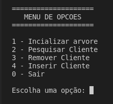
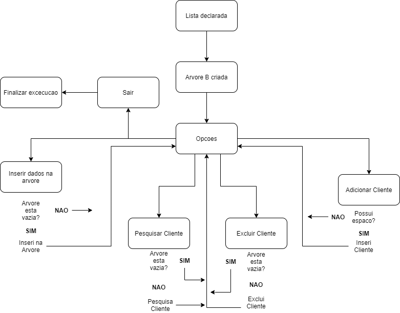

# Arvore B - Banco de Dados

## Compilacao

- Para compilar utilizar os comandos abaixo:

> make

> make clean

> make run

- O codigo foi desenvolvido no ambiente linux ubunto

## Menu

- Ao iniciliazar o programa tera 5 opcoes:
  - 0 -> Finalizaca o programa
  - 1 -> Inicializa a arvore com os intervalos caso nao tenha sido criada
  - 2 -> Realiza a pesquisa de um cliente pelo cpf caso exista
  - 3 -> Realiza a exclusao de um cliente pelo cpf caso exista
  - 4 -> Inseri um cliente no arquivo caso tenha espaco

- O diagrama abaixo mostra o funcionamento da aplicacao

  - Inicialmente a lista e declarada, sendo utilizada para guardar as informacacoes que seram gravadas no arquivo.

  - Em seguida a arvore B e criada com informacoes presentes no arquivo clientes-original.txt

  - No menu de opcoes a 5 caminho para percorrer:
    - Escolhendo a insercao dos dados na arvore, sera verificado se a arvore esta vazia, caso seja verdadeiro, retorna para o menu, caso falso, inserir na arvore e retorna ao menu.

    - Escolhendo a opcao Pesquisa de cliente, verifica se a arvore esta vazia, caso seja verdadeiro, retorna para o menu, caso falso, realiza a pesquisa do cliente e imprime o resultado caso encontre, em seguida retorna ao menu.

    - Escolhendo a opcao de Excluir cliente, verifica se a arvore esta vazia, caso seja verdadeiro, retorna para o menu, caso falso, realiza a pesquisa do cliente para exclusao e remove o valor do arquivo caso encontre, em seguida retorna ao menu.

    - Escolhendo a opcao de Adicionar cliente, verifica se a arvore esta vazia, caso seja verdadeiro, retorna para o menu, caso falso, verifica se o cpf do cliente que sera inserido existe no arquivo, caso verdadeiro, retorna ao menu, caso falso verifica se possui espaco para insercao, caso verdadeiro, realiza a insercao do valor no arquivo, em seguida retorna ao menu.

    - A opcao de sair finaliza a aplicacao.

## Base de dados

- A base de dados com o nome pode ser encontrada em:

  - https://basedosdados.org/dataset/br-ibge-nomes-brasil

## Criacao dos arquivos

- Ao executar o odigo e feita a leitura do arquivo "clientes-cpf.txt", "clientes-original.txt" e a criacao caso nao exista do arquivo "clientes-intervalo.txt".

- Caso a pasta clientes esteja vazia, descomente as linhas 16 e 17 para criacao dos arquivos.

## Remocao de cliente

- A remocao e feita removendo o arquivo para cria-lo novamente sem o cliente que foi excluido

## Insersao

- Para inserir valores e necessario que a arvore esteja preenchida inicialmente. O cliente so pode ser inserido nos intervalos disponiveis. O limite de valores em cada arquivo e de 10 clientes, o limite maximo e de 1000 clientes.

- A leitura de string dentro do swtich nao funcionou corretamente, logo o nome e estatico com um numero aleaotrio na frente seguido da idade.

## Informacoes

- 1000 dados de entrada

- cada dado possui (nome, idade, cpf): clientes

- cada pagina possui 10 dados por arquivo, um total de 100 arquivos

- m = 2, minino é igual a m-1 e maximo é igual a (m * 2) - 1
  - minino: 1 | maximo: 3